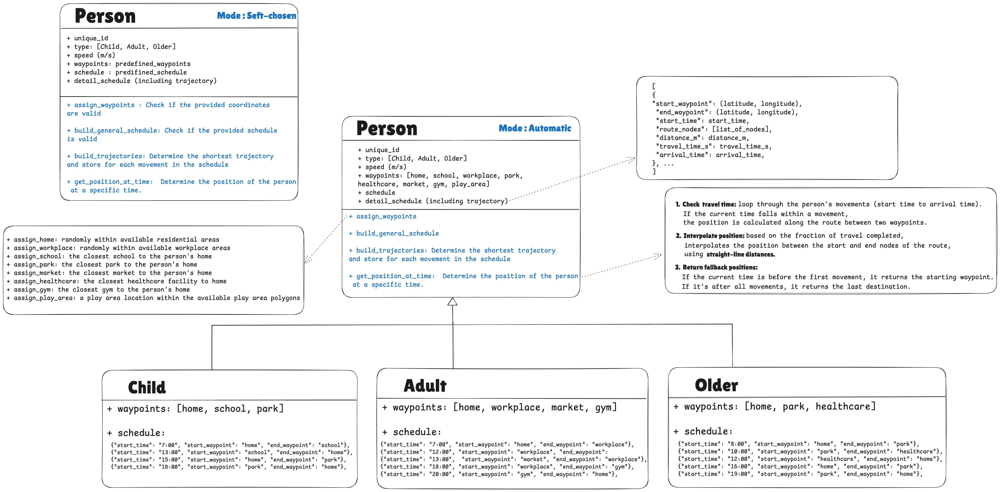

# Geo Data Generator

Geo Data Generator is a Python tool that simulates human activity and movement in a geographic area using OpenStreetMap (OSM) data. It generates realistic schedules, trajectories, and positions for different demographics (e.g., children, adults, older individuals) over a survey period. Integrated with Dash and Leaflet, it offers an interactive map interface for visualizing trajectories, waypoints, and current positions, supporting both automated and user-defined workflows for urban mobility and activity analysis.

## Features

- **Dynamic Geocoding**: Automatically determine the center point of a city using its name.
- **OSM Integration**: Load road networks and features (e.g., schools, parks, markets) from OpenStreetMap.
- **Person Simulation**: Simulate different types of people with realistic movement patterns:
    - Children: Travel to school, parks, etc., usually by bus.
    - Adults: Commute to workplaces, gyms, markets, usually by car.
    - Older individuals: Walk to healthcare centers, parks, etc.
- **Trajectory Calculation and Construction**: Calculate shortest paths and build realistic trajectories using network graphs.
- **Activity Simulation**: Generate realistic daily activity data for a survey period, including timestamps and positions.
- **Data Export**: Save simulated data to CSV for further analysis.
- **Customizable Modes**:
    - Automatic Mode: Automatically assign waypoints and schedules based on predefined activity patterns and demographic rules.
    - Self-Chosen Mode: Allow users to manually select waypoints and define schedules using an interactive map interface.
- **Interactive Map Visualization**: Use Dash and Leaflet to dynamically display trajectories, waypoints, and current positions, allowing users to define waypoints, create schedules, and track real-time positions interactively.

## Person Class Schema



## System Overview


## Survey Execution 
- **Objective**: The Survey class enables simulation of activity data for a group of people in a specified area over a defined period. Key features include realistic daily schedules, trajectory tracking, and seamless data export for further analysis.
- **Workflow**: 
    - **Initialize the Survey**: Specify parameters such as the city name, survey radius, number of participants, and the start and end dates for the survey.
    - **Simulate Activity**: Generate detailed daily activity logs, including timestamps and geolocations, based on realistic behavioral patterns tailored to children, adults, and older individuals.
    - **Export Data**: Save the simulated data as a CSV file for use in analytics or visualization tools.
- **Usage**:
To execute a survey and analyze the results, run the provided Jupyter Notebook file:
    ```
    geo_data_generator/main_survey.ipynb
    ```
## Dash Demonstration: Modes of Simulation
This project includes a Dash-based web interface to demonstrate two interactive simulation modes:

### Automatic Mode
- **Objective**: Automatically assign waypoints and generate schedules based on predefined rules for the selected person type (child, adult, or older individual).
- **Workflow**:
	- **City Selection**: Users select a city to set the simulation’s geographic center.
	- **Person Type Selection**: Users choose the type of person to simulate (e.g., child, adult, older individual).
	- **Automatic Waypoint Assignment**: Essential waypoints like home, school, or workplace are automatically assigned based on the selected person type.
	- **Schedule Simulation**: Generates a realistic daily schedule for the person, including specific start times and destinations.
	- **Trajectory Visualization**: Displays computed trajectories dynamically on an interactive map.
	- **Time-Based Position Tracking**: Allows users to input a specific time to view the simulated person’s position along their trajectory.
- **Usage**:
To run the application for automatic mode, use the following command:
    ```
    python3 geo_data_generator/dash_UI/app_automatic.py
    ```
### Self-Chosen Mode
- **Objective**: Provide users with the flexibility to manually select waypoints and define a custom schedule.
- **Workflow**:
    - **Editable Map Interaction**: Users can interact with an editable map to select and manage waypoints.
    - **Customizable Waypoints**: Waypoints can be renamed for better personalization and clarity.
    - **Schedule Definition**: Allows users to define schedules by selecting start and end waypoints along with specific times.
    - **User-Driven Simulation**: Simulates trajectories based on user-defined input for enhanced customization.
	- **Trajectory Visualization**: Displays computed trajectories dynamically on an interactive map.
	- **Time-Based Position Tracking**: Allows users to input a specific time to view the simulated person’s position along their trajectory.
- **Usage**:
To run the application for self-chosen mode, use the following command:
    ```
    python3 geo_data_generator/dash_UI/app_self_chosen.py
    ```
## Example Map Visualization

Below is an example of a map visualization showing the trajectory, waypoints and the current positon of a simulated person in Paris:
- **Red Line**: Represents the trajectory (shortest path) the simulated person follows.
- **Blue Markers**: Indicate predefined waypoints, such as home, workplace, or park.
- **Green Marker**: Shows the current position of the person at a specific timestamp during the simulation.

